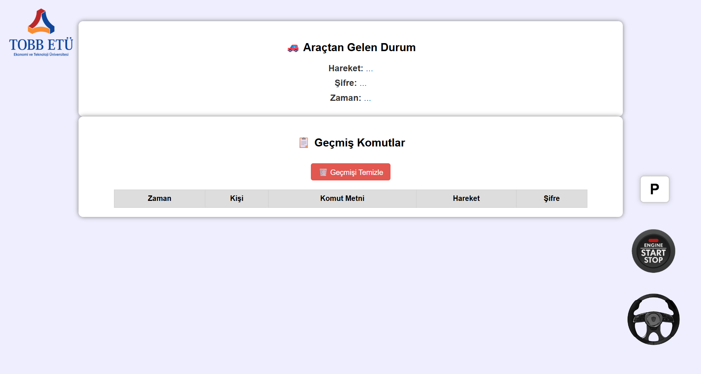
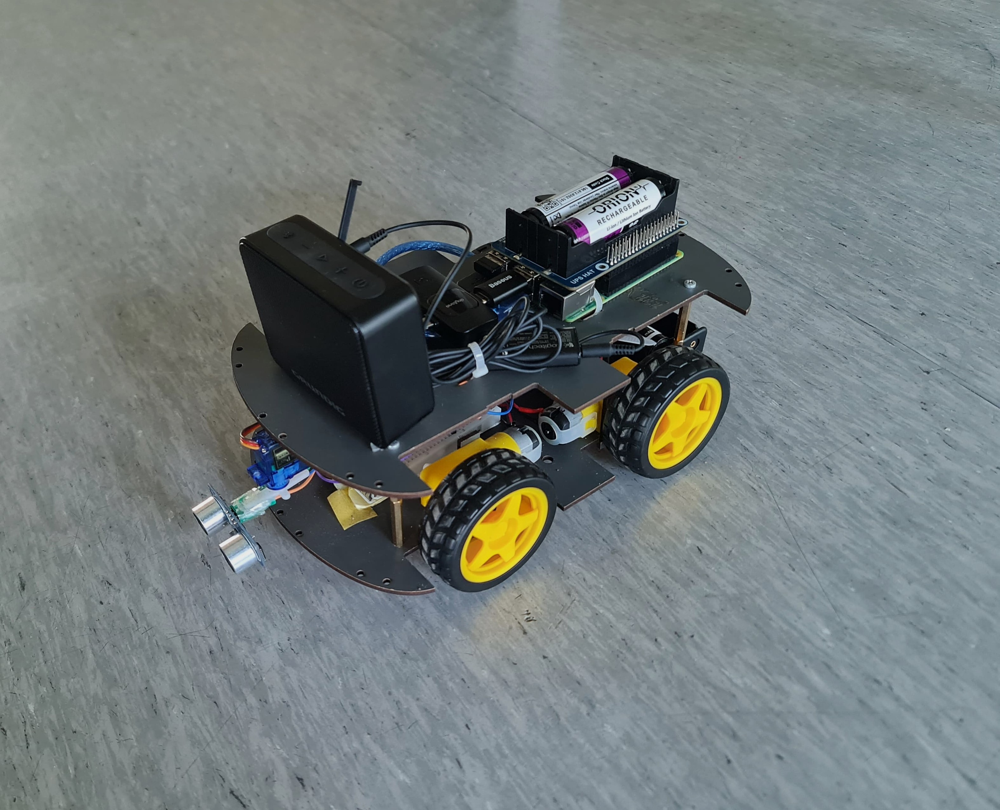

# TOBB ETÜ ELE495 - Capstone Project

# Table of Contents
- [Introduction](#introduction)
- [Features](#features)
- [Installation](#installation)
- [Usage](#usage)
- [Screenshots](#screenshots)
- [Acknowledgements](#acknowledgements)

## Introduction

The vehicle will send natural language voice commands received from the user to an artificial intelligence model (LLM). This will analyze the commands, translate them into basic driving commands, and execute these commands using sensors.

Furthermore, the vehicle will provide the user with vocal feedback, similar to natural Turkish speech (as non-robotic as possible), as the vehicle executes the commands.

The operating scenario can be briefly summarized as follows: The user gives a series of commands in natural Turkish (e.g., “engel çıkana kadar düz git, sonra sola dön, 2 saniye ileri git, sağa dön”). The vehicle's onboard microprocessor records the voice command and transcribes it using a voice recognition service. The transcribed command is analyzed using an artificial intelligence model (LLM) and converted into basic movement commands. The resulting commands are executed sequentially. The vehicle performs the assigned tasks through its motors and sensors. During the execution, the vehicle will provide users with vocal feedback in Turkish (e.g., "şu anda ileri gidiyorum", "sola dönüyorum").


## Features
- Hardware: The hardware components used 
  - [Rasberry Pi 4](https://www.robocombo.com/raspberry-pi-4-8gb-yeni-versiyon)
  - [Raspberry Pi UPS HAT](https://market.samm.com/tr-usd/raspberry-pi-ups-hat)
  - [Raspberry Pi  Sd Kart](https://market.samm.com/raspberry-pi-64gb-a2-class-hafiza-karti)
  - [Micro SD Hafıza Kart Okuyucu](https://www.hepsiburada.com/veggieg-usb-2-0-sd-ve-micro-sd-hafiza-kart-okuyucu-siyah-p-HBCV000075WAZD)
  - [HC-SR04 Arduino Ultrasonic Mesafe Sensörü](https://robolinkmarket.com/hc-sr04-arduino-ultrasonic-mesafe-sensoru?srsltid=AfmBOooZNz0LNqoCOcTf4P2N2B-U-qGTtOwfh3LrpjtQ432j951cvKpiRXQ&gStoreCode=robolinkG1)
  - [L298N Motor Sürücü Kartı](https://robolinkmarket.com/l298n-motor-surucu-karti?srsltid=AfmBOoprUP9nhtKZ9o601lqJdaMOPEYprGBfUbroT7UoArpduLZ_hXtT6Pk&gStoreCode=robolinkG1)
  - [Arduino Nano](https://www.robotistan.com/arduino-nano?language=tr&h=1617316c)
  - [MPU9250 9 Eksenli Gyro ve Eğim Sensörü](https://www.robocombo.com/mpu-9250-9-eksen-jiroskop-ivmeolcer-manyetometre-sensor-modulu?srsltid=AfmBOorEJfvat3dhbArzxP1OZkIcCixFGoXX8n1p_biLCCXOeLeWURcTlkw)
  - [Mikrofon](https://www.hepsiburada.com/daytona-k9-c2-wireless-3in1-kablosuz-mikrofon-type-c-lightning-3-5mm-jak-ciftli-yaka-mikrofonu-p-HBCV00004625CL?magaza=Alcamseni)
  - [Hoparlör](https://www.hepsiburada.com/grundig-solo-bluetooth-hoparlor-siyah-p-HBCV000051RRB7)
  - [Servo Motor](https://www.robocombo.com/SG90-RC-Servo-Motor,PR-141.html?srsltid=AfmBOoriSRx2NBEiuyk6wXhx8eV2KMV2gDN1X_tiDEVRmnpVYjCCJ1HwYyU)
  - [USB 3.1 To Type-C Dönüştürücü](https://www.hepsiburada.com/baseus-usb-3-1-to-type-c-donusturucu-adaptor-mini-otg-baseus-ingenuity-series-zjjq000101-p-HBCV00001TCC3G?magaza=IVOOMI)
- Operating System and packages
  - Raspberry Pi OS
  - Python 3.x
  - Windows 10 or later
- Python Libraries
  - `resemblyzer`, `speechbrain` – Speaker recognition
  - `speech_recognition`, `pyaudio` – Voice command input
  - `socket`, `json`, `datetime` – Networking and data handling
  - `numpy`, `scipy.spatial.distance` – Data processing
  - `gtts`, `subprocess` – Text-to-speech
  - `serial` (`pyserial`) – Serial communication
  - `os`, `re`, `tempfile`, `ctypes` – System utilities
  - `socketio`, `ipaddress` – WebSocket & IP
- Applications
  - Real-Time Wi-Fi Communication via TCP
  - Feasibility-Based Command Execution
  - Sequential Command Feedback Display
  - Safe Motor Activation/Deactivation
  - Authorized User Voice Verification
- Services
  - `Google Generative AI (Gemini)` – Natural language understanding
  - `Google Text-to-Speech (gTTS)` – Converts response or warnings into Turkish audio feedback
  - `mpg123 (external)` – Plays generated .mp3 audio files for feedback and status notifications
  - `Python SocketIO` – Real-time communication between Raspberry Pi and server interface.
  - `PySerial` – Communicates with Arduino via USB for motor and sensor control
  - `SpeechRecognition + PyAudio` – Captures voice commands through USB microphone and performs STT (Speech to Text)
  - `Resemblyzer + SpeechBrain` – Speaker identification based on combined voice embeddings
  - `Torchaudio` – Preprocessing of audio input for speaker verification

## Installation
Describe the steps required to install and set up the project. Include any prerequisites, dependencies, and commands needed to get the project running.

### Raspberry Pi Setup

1. **Initial Setup:**  
   Flash the Raspberry Pi OS using Raspberry Pi Imager.

   Complete the initial boot process (Wi-Fi, locale, etc.).
 
   Enable SSH via raspi-config or place an empty file named ssh in the boot partition.

2. **SSH Connection:**  

```bash

ssh pi@<raspberry-pi-ip>

```

3. **Clone the Project:**

```bash
git clone https://github.com/ELE495-2425Summer/capstoneproject-mut33-grup3.git 
cd capstoneproject-mut33-grup3/rasp
```
4. **Install Dependencies:**

```bash

pip install -r requirements.txt

```

### Desktop (GUI / Flask Server) Setup

This is the WebSocket server and interface for real-time monitoring.

1. **Clone Repository:**

On your desktop machine: 

```bash
git clone https://github.com/ELE495-2425Summer/capstoneproject-mut33-grup3.git 
cd capstoneproject-mut33-grup3/gui
```

2. **Install Gui Repository Dependencies:**

```bash

pip install -r gui_requirements.txt

```

3. **Run the Flask Server:**

```bash

python gui.py

```
### Desktop (GUI / Flask Server) Setup

1. **Upload Firmware:**

Open Arduino IDE.

Go to Arduino/arduino_control.ino.

Select your board (Arduino Nano) and port (e.g., /dev/ttyUSB0 or COM3).

Click Upload.


## Usage

1. **Run Main Code on Raspberry Pi**  
```bash

python3 codes/rasp/raspberry_code.py

```

This starts voice recognition, speaker verification, Gemini-based command parsing, and Arduino control.

2. **Run the Interface Code**  
   ```bash
   python3 codes/gui/gui.py
   
3. **Once you hear “Sunucuya bağlanıldı” you can start the car using the button on the interface.**
   
4. **Finally, after hearing “Sizi dinliyorum” you can give your command to the car.**


## 📷 Screenshots

### 🔹 Interface



### 🔹 Car



## Acknowledgements

### Contributors
- [İbrahim Berk Deliçay](https://github.com/Ibrahimberko)
- [Barış Ünal](https://github.com/BarisUnalELE)
- [Osman Cesur](https://github.com/Osman-Cesur)
- [Mehmet Melih Özbilen](https://github.com/Mehmet-Melih-Ozbilen)
- [Emre Doğan](https://github.com/EmreDogan33)

### Resources
- [Rasperry Pi Official Documentation](https://www.raspberrypi.com/documentation)
- [Google AI Studio (Gemini API)](https://aistudio.google.com/prompts/new_chat)
